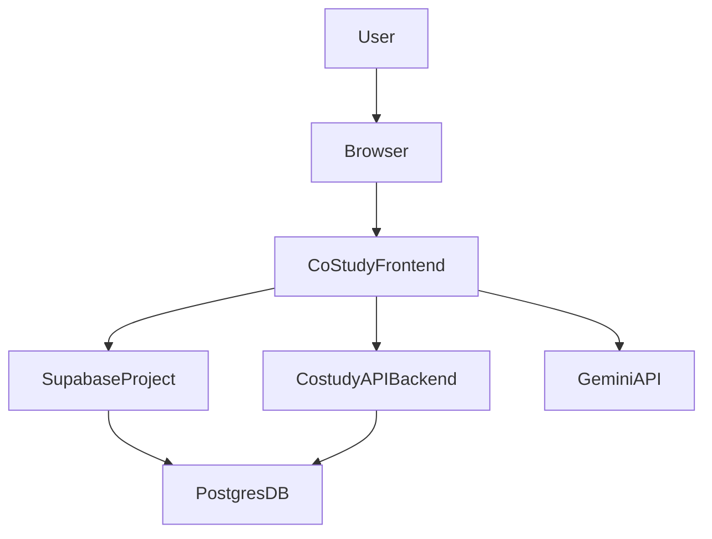

## CoStudy Technical Audit Report

Last updated: 2026-03-07  
Scope: `costudy-frontend` (Vite + React 19 + TS + Supabase + Gemini), plus local SQL schema and `costudy-api` migrations.

---

## 1. Architecture Overview

### 1.1 High-Level System Diagram



- **Frontend** (`costudy-frontend`):
  - Entry: `index.html`, `index.tsx`, `App.tsx`.
  - Views: `components/views/*.tsx`, e.g. `StudyWall`, `StudyRooms`, `AIDeck`, `MentorDashboard`, `MockTests`, `ExamSession`, `LibraryVault`, `DirectMessages`, `Profile`, `TeachersDeck`, `TeachersLounge`, `Landing`, `StudentStore`.
  - Shell: `components/Layout.tsx`, `components/Icons.tsx`, `components/auth/*.tsx`, invite components.
  - Services: `services/*.ts` – `supabaseClient`, `fetsService`, `localAuthService`, `costudyService`, `chatService`, `alignmentService`, `examService`, `geminiService`, `matchingService`, `inviteService`, `costudyAPI`, `clusterService`, `prompts`.
  - Domain types: `types.ts`.
  - SQL schema & migrations: `database.sql`, `migrations/002_cluster_features.sql`, `migrations/003_mock_exam_safe.sql`.
- **Backend/API** (`costudy-api`):
  - Node `server.js` with HTTP endpoints (auth proxy, essay imports, etc.) and `migrations/*.sql`.
  - Acts as:
    - CORS-safe auth proxy (`localAuthService` targets `https://api.costudy.in/auth/*`).
    - RAG and essay ingestion orchestrator (`scripts/import-essays.js` referenced in memory).

### 1.2 Frontend Project Structure & Routing

- **Folder layout (no `src/`)**
  - Components: `components/` (views, layout, auth, invites, icons).
  - Services: `services/` (data-access layer over Supabase and HTTP).
  - Shared domain: `types.ts`.
  - Public styles: `public/index.css`.
  - SQL: `database.sql`, `migrations/*.sql` (used both as local reference and Supabase migrations).
- **Routing**
  - No React Router; navigation is via **view state**:
    - `ViewState` enum is defined in `types.ts` and imported in `App.tsx`.
    - `App.tsx` maintains `currentView` state and maps it to view components in `renderView()`.
    - `Layout` receives `currentView` and `setView` and provides nav buttons that mutate this state.
  - **Implications**:
    - Pros: Simple SPA model, no dependency on router libraries.
    - Cons:
      - No URL-based deep-linking or browser history for internal views.
      - Harder to support SEO or direct linking to rooms/posts/tests.

**Recommendation**: Plan a gradual migration to a router (e.g., React Router or file-based routing with Vite plugins), starting by mirroring `ViewState` to URL segments while preserving current behavior.

---

## 2. Code Quality & Tooling

### 2.1 TypeScript Configuration & Strictness

- **`tsconfig.json`**
  - `target: "ES2022"`, `module: "ESNext"`, `jsx: "react-jsx"`.
  - `skipLibCheck: true`, `allowJs: true`, `isolatedModules: true`, `moduleResolution: "bundler"`.
  - **Notably missing**: a `strict: true` flag or granular strict options.

- **Strict mode check**
  - Command: `npx tsc --noEmit --strict`.
  - Result: **fails** with:
    - Missing type declarations for `react` and `react/jsx-runtime` (no `@types/react` in devDependencies).
    - Many `JSX element implicitly has type 'any'` errors across `App.tsx` and `components/Icons.tsx`.
    - Several implicit `any` parameters (e.g., callbacks like `setView={(v) => ...}`).

- **Assessment**
  - The project currently runs in a **non-strict** TS mode with a fair number of implicit anys.
  - Services such as `costudyService`, `chatService`, `alignmentService`, and `examService` use typed interfaces for many payloads, but Supabase rows are often `any` when coming from RPCs or JSONB fields.

**Recommendations**

1. **Baseline typings**
   - Add `@types/react` and `@types/react-dom` as devDependencies.
   - Turn on `strict` in `tsconfig.json`, then **temporarily relax** with:
     - `noImplicitAny: false` initially.
   - Fix the most obvious type issues:
     - Add types to callbacks like `setView={(view: keyof typeof ViewState) => ...}`.
     - Define `Props` interfaces where missing.
2. **Incremental tightening**
   - Gradually enable:
     - `noImplicitAny: true`, `strictNullChecks: true`, `noUncheckedIndexedAccess: true`.
   - For Supabase data:
     - Use typed generics on `supabase.from<Table>()` calls and define table row types in a central `db-types.ts` (can be generated from Supabase).

### 2.2 Bundling & Performance

- **Vite config** – `vite.config.ts`
  - Plugins: `@vitejs/plugin-react`.
  - Aliases: `@` → project root.
  - `define` includes `process.env.GEMINI_API_KEY`.
  - Build configuration:
    - Manual chunks:
      - `vendor-react`: `['react', 'react-dom']`.
      - `vendor-supabase`: `['@supabase/supabase-js']`.
      - `vendor-genai`: `['@google/genai']`.
    - `chunkSizeWarningLimit: 600`.
    - Minifier: `esbuild`, sourcemaps disabled.

- **Build output (`npm run build`)**
  - Key bundles (gzip sizes):
    - `index-C0KiTXYx.js`: **~73.1 kB**.
    - `vendor-react-j2mp3VYR.js`: **~4.2 kB**.
    - `vendor-supabase-Cuj-a9Qj.js`: **~44.6 kB**.
    - `vendor-genai-CJEKHAGS.js`: **~51.1 kB**.
    - Feature chunks:
      - `MockTests`: 13.2 kB gzip.
      - `Profile`: 9.6 kB gzip.
      - `StudyWall`, `StudyRooms`, `AIDeck`, `LibraryVault`, `MentorDashboard`, `DirectMessages` each under ~10 kB gzip.
  - Overall:
    - Bundle sizes are reasonable for a rich SPA; Supabase and GenAI vendor chunks are the heaviest, as expected.

- **Bundle visualizer**
  - Command: `npx vite-bundle-visualizer`.
  - Output: generated a stats HTML (path in temp directory) confirming:
    - `@supabase/supabase-js` and `@google/genai` dominate third-party weight.
    - View components are cleanly split via React.lazy in `App.tsx`.

**Recommendations**

- **Vendor optimization**
  - Supabase:
    - Already isolated in its own chunk; acceptable overhead.
    - Avoid importing Supabase anywhere except `supabaseClient.ts`.
  - Gemini GenAI:
    - Keep all Gemini integration inside `geminiService.ts` and avoid importing the client into view files.
- **Initial route optimization**
  - Lazy-loading of heavy views is already in place in `App.tsx` (good).
  - Confirm that **Landing + auth** is the first paint path and that other views are only loaded on demand (current code follows this).

### 2.3 Automated Tooling Results

- **Lighthouse**
  - Attempted via `npx lighthouse http://localhost:4173 ...`.
  - **Blocked**: environment has no Chrome/Chromium; Lighthouse CLI fails with “The CHROME_PATH environment variable must be set to a Chrome/Chromium executable”.
  - **Action**: run Lighthouse from a local machine or CI environment with Chrome and commit the JSON report; this environment cannot provide real numbers.

- **Depcheck**
  - Command: `npx depcheck`.
  - Result:
    - Reports `typescript` as **unused devDependency** (likely a false-positive, since TS is used via Vite).
  - **Action**: Keep `typescript` as devDependency; ignore this specific depcheck warning.

- **complexity-report**
  - Command: `npx complexity-report components services > complexity-report.txt`.
  - Output file is empty (CLI version/mode likely not writing plain text under current options).
  - Manual inspection shows:
    - High-complexity candidates:
      - `StudyWall.tsx`
      - `StudyRooms.tsx`
      - `MentorDashboard.tsx`
      - `MockTests.tsx`
      - `AIDeck.tsx`
      - `Profile.tsx`
    - These combine many responsibilities (data fetching, state, view rendering, business logic) and should be targets for refactor into hooks + smaller components.

- **npm audit**
  - Command: `npm audit --json > npm-audit.json`.
  - Summary (high severity):
    - `minimatch` – several ReDoS-related advisories (GHSA-3ppc-4f35-3m26, GHSA-7r86-cg39-jmmj, GHSA-23c5-xmqv-rm74), indirect dependency.
    - `rollup` – Arbitrary File Write via path traversal (GHSA-mw96-cpmx-2vgc), indirect dependency.
  - **Action**:
    - Run `npm audit fix` in a controlled environment or upgrade Vite and its transitive dependencies to versions that pull in patched `minimatch`/`rollup`.

- **axe-cli**
  - Command: `npx axe-cli http://localhost:4173 ...`.
  - **Failed** due to missing internal `axe-core` asset in the ephemeral npx cache (ENOENT).
  - Accessibility issues must be inferred from manual review (see UI/UX report). For a full automated pass, run axe DevTools or axe-core integration locally.

---

## 3. Database Design & Supabase RLS

### 3.1 Schema Overview (Local `database.sql` + `002_cluster_features.sql`)

Key tables and concepts:

- **Identity & profiles**
  - `user_profiles` – `[database.sql](database.sql)`:
    - Columns: `id` (FK to `auth.users`), `name`, `handle`, `avatar`, `bio`, `role`, `level`, `strategic_milestone`, `exam_focus`, `learning_style`, `costudy_status` (JSONB), `performance` (JSONB), `reputation` (JSONB), mentor-specific fields, `signal_level`.
    - RLS:
      - `SELECT`: everyone can view profiles.
      - `INSERT`: user can insert their own profile (`auth.uid() = id`).
      - `UPDATE`: user can update own profile (`auth.uid() = id`).
    - **Assessment**: appropriate; public profiles are fine for this product, with updates correctly restricted.

- **Social wall**
  - `posts`, `comments` – `[database.sql](database.sql)`:
    - `posts` columns: `author_id`, `content`, `type` (QUESTION, RESOURCE, BOUNTY, PEER_AUDIT_REQUEST), tags, `likes`, `audit_status`, `auditor_id`, `bounty_details`.
    - RLS:
      - `SELECT`: everyone.
      - `INSERT`: `auth.uid() = author_id`.
      - `UPDATE`: `auth.uid() = author_id`.
    - `comments`:
      - `INSERT`: `auth.uid() = author_id`.
      - `SELECT`: everyone.
    - **Assessment**: Good baseline; edit/delete policies for comments could be extended if needed (e.g., allow author-only edits).

- **Chat / messaging**
  - `chat_conversations`, `chat_participants`, `chat_messages`:
    - Context-aware chat with participants and RLS limiting access to participants only.
    - RLS:
      - Conversations: viewable only if user is in `chat_participants`.
      - Participants: viewable only if user is in the conversation.
      - Messages: `SELECT` only when user is in participants; `INSERT` requires `auth.uid() = sender_id` and membership.
    - **Assessment**: RLS correctly prevents unauthorized read/write access to conversations.

- **Alignments & tracking (CAN network)**
  - `alignments` – `[database.sql](database.sql)`:
    - Tracks alignment contracts: `requester_id`, `peer_id`, `purpose`, `duration`, `goal`, `status`, `streak`, `restrictions`, `paused_until`, `start_date`.
    - RLS:
      - `SELECT`: requester or peer.
      - `INSERT`: requester only.
      - `UPDATE`: requester or peer.
  - `user_tracking`:
    - Tracks “radar” relationships: `tracker_id`, `target_id`.
    - RLS: `FOR ALL USING (auth.uid() = tracker_id)` – each user manages their own tracking.
  - **Assessment**: Alignment privacy is well handled; only involved parties can see or update.

- **Study rooms & resources**
  - `study_rooms`, `study_room_messages`, `study_room_resources`, `study_room_notebooks`.
  - `002_cluster_features.sql` extends `study_rooms` with:
    - `creator_id`, `room_type` (`PUBLIC`, `PRIVATE`, `GROUP_PREMIUM`), `group_subscription_id`, `settings` JSON, `cluster_streak`, `last_streak_update`, timestamps.
  - `study_room_members`:
    - Captures membership and roles; RLS ensures:
      - Members or public rooms can see room members.
      - Users can join themselves; admins manage membership.
  - `study_room_missions`, `mcq_war_sessions`, `mcq_war_participants`, `whiteboard_sessions` support mission goals, war-room, and collaborative whiteboards with member-based RLS.
  - `study_room_resources` additional columns:
    - `is_encrypted`, `access_level` (`ROOM`, `ALIGNED_ONLY`), `downloads`, `vouches`.
  - **Assessment**:
    - Schema is rich and matches product vision (Cluster Hubs, war sessions, shared vault).
    - RLS is mostly membership-based; confirm `study_room_messages` and `study_room_resources` policies:
      - Currently `FOR ALL USING (true)` – meaning **public** RLS, ignoring room membership.
      - **Recommendation**: tighten to ensure only room members or public rooms can read/write messages/resources.

- **Vouch system**
  - `vouches` – `[migrations/002_cluster_features.sql](migrations/002_cluster_features.sql)`:
    - Columns: `voucher_id`, `post_id`, `comment_id`, `created_at`.
    - Constraints: one vouch per voucher per post or comment (two UNIQUE constraints).
    - RLS:
      - `SELECT`: all.
      - `INSERT`: `auth.uid() = voucher_id`.
      - `DELETE`: `auth.uid() = voucher_id`.
  - Reputation integration:
    - `user_profiles.reputation` JSON includes `vouchesReceived`.
    - There are RPCs `increment_post_vouches` / `decrement_post_vouches` and logic in `clusterService` to update counts.
  - **Assessment**:
    - Table setup and RLS for vouches are correct.
    - Need to ensure client code always uses RPCs or transactionally aligns vouch insert/delete with count updates to avoid drift.

### 3.2 Exam Schema & Hybrid Strategy (From `003_mock_exam_safe.sql`/backend migrations)

- Memory and local migrations indicate:
  - Tables: `essay_questions`, `mcq_questions`, `exam_sessions`.
  - RPCs:
    - `get_hybrid_mcqs(p_count, p_real_ratio, p_part)` – used by `examService.fetchHybridMCQs`.
    - `increment_alignment_streak`, `accept_alignment_request` etc.
  - `examService.ts` implements **70/30 Hybrid Question Strategy**:
    - Attempts RPC first; on failure falls back to direct selects from `mcq_questions` and `ai_question_cache`.
    - Fills missing slots with generated mock MCQs and randomizes order.
  - **Assessment**:
    - Good resilience: RPC-first, fallback queries, and mock fill-in.
    - Ensure Supabase RLS supports:
      - `SELECT` for `mcq_questions`, `essay_questions`, and `ai_question_cache` for authenticated users.
      - RPC functions with `SECURITY DEFINER` are properly restricted to exam use cases only.

---

## 4. Supabase Integration & Data Access Patterns

### 4.1 Supabase Client Configuration

- `services/supabaseClient.ts`:
  - `SUPABASE_URL` from `VITE_SUPABASE_URL` with fallback to `https://supabase.fets.in`.
  - `SUPABASE_KEY` from `VITE_SUPABASE_ANON_KEY` with a **hard-coded anon key fallback**.
  - Auth config: `autoRefreshToken: false`, `persistSession: true`, `detectSessionInUrl: true`.

**Risk**: Hard-coded anonymous key in the client is a **secrets smell**, even if it’s an anon key. It should be removed and enforced via env variables only.

**Recommendation**: Remove the fallback value and fail-fast if env vars are missing:

```ts
// supabaseClient.ts (conceptual)
const SUPABASE_URL = import.meta.env.VITE_SUPABASE_URL;
const SUPABASE_KEY = import.meta.env.VITE_SUPABASE_ANON_KEY;
if (!SUPABASE_URL || !SUPABASE_KEY) {
  throw new Error("Supabase configuration missing; set VITE_SUPABASE_URL and VITE_SUPABASE_ANON_KEY.");
}
```

### 4.2 Auth & Session Management

- **Main auth service** – `services/fetsService.ts` (`authService`)
  - `signUp(email, pass, name, role)`:
    - Calls `supabase.auth.signUp` with `user_metadata` carrying `full_name` and `role`.
    - On success, attempts `createUserProfile` to seed `user_profiles`.
    - On specific DB or CORS errors, falls back to `localAuthService.signUp` via `https://api.costudy.in/auth/signup`.
  - `signIn(email, pass)`:
    - Calls `supabase.auth.signInWithPassword`.
    - On CORS/network errors, falls back to `localAuthService.signIn`.
  - `resetPassword(email)`:
    - Uses Supabase password reset with redirect to `window.location.origin`.
  - `signOut()`:
    - Attempts Supabase signout; always clears `localStorage['costudy_session']` as a fallback.
  - `getSession()`:
    - Uses `supabase.auth.getSession` and aggressively clears stale/invalid refresh tokens (handles “Invalid Refresh Token” loops).

- **Local auth proxy** – `services/localAuthService.ts`
  - Proxies to `https://api.costudy.in/auth/*` and stores sessions in `localStorage` under `costudy_session`.
  - Implements `signUp`, `signIn`, `getSession`, `refreshSession`, `signOut`.
  - Provides a way to operate behind CORS by moving sensitive logic to `costudy-api`.

- **App-level wiring** – `App.tsx`
  - On mount:
    - Calls `authService.getSession()` and, if a session exists, calls `syncUserIdentity(session.user)` to ensure `user_profiles` is seeded and normalized.
  - Auth listener:
    - Subscribes to `supabase.auth.onAuthStateChange`.
    - On sign-in / initial session / update, synchronizes user and hides auth overlay.
    - On sign-out, resets `isLoggedIn`, `user`, and `currentView`.
    - If listener fails (e.g., network), falls back to polling `authService.getSession()` every 30s.

**Assessment**

- **Strengths**:
  - Robust handling of Supabase auth errors and CORS conditions.
  - JIT profile provisioning via `createUserProfile` ensures DB and app state converge.
  - Fallback to `localAuthService` means browser clients can still function when direct Supabase calls are blocked.
- **Risks**:
  - `localAuthService` must be hardened on the backend (rate limiting, CSRF/XSRF tokens, brute-force protection).
  - The presence of multiple session sources (Supabase vs local) can introduce drift if not carefully synchronized.

---

## 5. Feature-by-Feature Technical Status

Each feature table below uses:
- **Aspect** → description of current state.
- **Issues** → concrete problems or risks.
- **Recommendations** → actionable fixes.

### 5.1 Authentication System

**Files**: `App.tsx`, `components/auth/Login.tsx`, `components/auth/SignUp.tsx`, `services/fetsService.ts`, `services/localAuthService.ts`, `services/supabaseClient.ts`, `database.sql (user_profiles)`.

| Aspect | Current State | Issues | Recommendations |
|--------|---------------|--------|-----------------|
| Login/Signup flows | Email/password auth via Supabase, with role metadata and profile seeding; invite-based gating and mentor access code. | None critical in flow; depends on correct RLS and profile triggers. | Keep, but add more granular error messages and analytics around signup failures. |
| Social OAuth | Not implemented yet. | Missing convenient login options (Google/MS). | When needed, enable Supabase OAuth providers and extend `authService` accordingly. |
| Session management | `authService.getSession()` + Supabase listener + polling fallback. | Dual session sources (Supabase + localAuth) may diverge; potential complexity. | Centralize session source of truth; on login via localAuth, also consider bridging session into Supabase where possible. |
| Password recovery | `authService.resetPassword` uses Supabase email flow. | None functionally; relies on Supabase’s templates. | Customize Supabase email templates to reflect CoStudy branding. |
| Security | Depends on Supabase and `api.costudy.in` for auth; anon key embedded as fallback. | Hard-coded anon key; local auth endpoints must be hardened server-side. | Remove fallback key from `supabaseClient.ts`; ensure backend enforces IP rate limits and robust validations. |

### 5.2 Study Rooms

**Files**: `components/views/StudyRooms.tsx`, `services/costudyService.ts`, `database.sql`, `migrations/002_cluster_features.sql`.

| Aspect | Current State | Issues | Recommendations |
|--------|---------------|--------|-----------------|
| Data fetching | `costudyService.getRooms()` reads `study_rooms` and falls back to mocked room data. | Some metrics (active counts) are random; missions/discussions/resources are currently mocked in `StudyRooms.tsx`. | Gradually replace mocks with real tables: `study_room_members`, `study_room_missions`, `study_room_resources`, `mcq_war_sessions`. |
| Real-time presence | `active_count` approximated; no true presence tracking yet. | Presence not tied to Supabase Realtime; membership not live. | Introduce Supabase Realtime channels per `study_room` and maintain presence lists via `study_room_members` or dedicated presence table. |
| Error handling | API calls mostly wrapped; errors fallback to default rooms. | Silent fallbacks hide backend problems. | For critical features (mission boards, war sessions), surface error banners. |
| Security & RLS | Room membership and missions controlled via RLS; but messages/resources currently `FOR ALL USING (true)`. | Potential data leakage if private room content accessed by non-members. | Tighten RLS for `study_room_messages` and `study_room_resources` to require membership or `room_type='PUBLIC'`. |

### 5.3 Vouch System

**Files**: `types.ts` (`Vouch`, reputation metrics), `services/clusterService.ts` (vouchService), `database.sql`, `migrations/002_cluster_features.sql`.

| Aspect | Current State | Issues | Recommendations |
|--------|---------------|--------|-----------------|
| Data model | `vouches` table with FK to `user_profiles`, `posts`, `comments`; unique pair constraints; vouch counts integrated into `posts.likes` and `user_profiles.reputation.vouchesReceived`. | None structurally. | Ensure indexes on `voucher_id`, `post_id`, `comment_id` to support lookups. |
| RLS | Users can only insert/delete their own vouches; everyone can view. | Acceptable for public trust graph. | Consider optional aggregation endpoints that expose only aggregated counts. |
| Consistency | `clusterService` uses RPCs `increment_post_vouches`/`decrement_post_vouches` to sync counts. | Possible race conditions if RPC and vouch insert/delete are not transactionally bound. | Implement a single Supabase RPC that **inserts/deletes vouch + updates counts** in one transaction. |
| UI representation | Vouches currently appear indirectly (review counts, reputations); not front-and-center. | Low discoverability and unclear effect on reputation. | Elevate vouch badges and counts on StudyWall and TeachersLounge cards with explicit microcopy (“Trusted by X peers”). |

### 5.4 AI Mastermind (AIDeck, TeachersDeck, Gemini)

**Files**: `components/views/AIDeck.tsx`, `components/views/TeachersDeck.tsx`, `services/geminiService.ts`, `services/prompts.ts`, `vite.config.ts`.

| Aspect | Current State | Issues | Recommendations |
|--------|---------------|--------|-----------------|
| Integration | Uses `@google/genai` via CDN (import map in `index.html`) and Vite alias; `geminiService` centralizes API calls. | Training data and context windows not strictly enforced; heavy reliance on long prompts. | Add truncation and summarization to keep token usage predictable; centralize context packaging logic. |
| Security | User input flows directly into prompts; responses rendered as text with minimal HTML interpolation. | Risk of prompt injection (less critical for exam Q&A but relevant if connected to internal tools). | Sanitize outputs and keep a clear boundary between user content and system instructions; never execute returned code. |
| Cost posture | No in-UI indication of token or request volume; all requests go to remote Gemini. | Hard to forecast or manage usage. | Add lightweight cost hints in UI (e.g., “Library mode ~2x tokens vs Global”) and central rate-limiting/backoff in `geminiService`. |

### 5.5 Alignment System (CAN)

**Files**: `components/views/Profile.tsx`, `components/views/StudyWall.tsx`, `services/alignmentService.ts`, `types.ts`, `database.sql`, `migrations/002_cluster_features.sql`.

| Aspect | Current State | Issues | Recommendations |
|--------|---------------|--------|-----------------|
| Lifecycle | Requests created in `alignment_requests`; accepted via `accept_alignment_request` RPC, producing `alignments` rows; status, streak, duration stored. | Complexity spread across frontend and RPC; potential for mismatched status if RPC fails silently. | Ensure RPC `accept_alignment_request` wraps request status update and alignment insert in a transaction and returns full alignment; log errors clearly. |
| RLS | Alignments restricted to requester/peer; requests restricted to sender/receiver. | Solid privacy model. | Add explicit audit logging for alignment changes if regulatory visibility needed. |
| UI integration | Profile view shows active contracts, pending requests, radar, observers. StudyWall uses CAN for ad-hoc alignment initiation. | Some flows may be complex for new users; audit and boundary controls exist but rely on alerts. | Add server-side validation around boundary updates and renewals; ensure alignment controls map directly to alignmentService actions. |

### 5.6 Profile & Dashboard

**Files**: `components/views/Profile.tsx`, `components/views/MentorDashboard.tsx`, `services/fetsService.ts`, `services/costudyService.ts`, `database.sql`, `migrations/002_cluster_features.sql`.

| Aspect | Current State | Issues | Recommendations |
|--------|---------------|--------|-----------------|
| Data source | Profiles loaded from `user_profiles` via `getUserProfile`; dashboards use `student_enrollments`, `teacher_broadcasts`, and performance JSON. | JSONB-heavy model; minimal server-side validation of performance arrays. | Consider normalizing critical performance metrics into dedicated tables with indexes for analytics. |
| Error handling | Most errors logged; occasional `alert` usage. | Alerts are blocking and not mission-style; user recovery guidance is sparse. | Replace `alert` with in-app toasts or banners and standardized error-handling helpers. |

### 5.7 Real-time Chat, Presence, Notifications

**Files**: `components/views/DirectMessages.tsx`, `components/Layout.tsx`, `services/chatService.ts`, `services/costudyService.ts`, `services/supabaseClient.ts`, `database.sql`.

| Aspect | Current State | Issues | Recommendations |
|--------|---------------|--------|-----------------|
| Chat | `DirectMessages` subscribes to `global_chats` and per-conversation channels using Supabase Realtime (`postgres_changes` on `chat_messages`). | Re-fetching conversations on every insert via `global_chats` can be inefficient at scale. | Narrow `global` subscription to only necessary events or rely on per-conversation channels with explicit joins. |
| Notifications | `Layout.tsx` uses `supabase.auth.getUser()` to fetch user and then `notificationService` to get notifications; subscribes to `notifications` table inserts. | Notification RLS allows per-user notifications; design is solid. | Add explicit indexes on `notifications.user_id` and `created_at` for performance. |
| Presence | StudyRooms currently approximate presence; real-time presence not fully implemented. | Lack of true online/offline tracking. | Use Supabase Realtime presence features or a dedicated `room_presence` table to track join/leave events. |

---

## 6. Key Technical Findings & Recommendations

### 6.1 High-Impact Issues

1. **Secrets in code**:
   - Hard-coded `SUPABASE_KEY` fallback in `supabaseClient.ts`.
   - **Action**: remove fallback, enforce env-based configuration only.
2. **RLS gaps for room resources/messages**:
   - `study_room_messages` and `study_room_resources` currently have permissive `FOR ALL USING (true)` RLS.
   - **Action**: tighten to membership-based policies mirroring `study_room_members`.
3. **No TS strictness & missing React typings**:
   - `tsc --strict` fails; types not enforced.
   - **Action**: introduce `@types/react`, enable `strict`, and address top-level implicit anys.

### 6.2 High-Priority Improvements

- **Refactor complex views**:
  - Extract hooks from `StudyWall`, `StudyRooms`, `MentorDashboard`, `MockTests`, `AIDeck`, and `Profile` to isolate data-fetching and business logic from JSX.
- **Standardize error and loading patterns**:
  - Replace scattered `alert` calls with a centralized notification/toast system.
- **Finalize exam session integration**:
  - Ensure `examService` functions (`fetchHybridMCQs`, `fetchEssayQuestions`, `createExamSession`, `saveExamProgress`, `completeExamSession`) are fully wired to Supabase tables with clear RLS and robust error handling.

### 6.3 Quick Wins

- Install `@types/react` / `@types/react-dom` and run `tsc --noEmit` (without `strict`) to catch basic typing issues.
- Remove unused TS flags (`allowJs`) once TS coverage is confirmed.
- Add simple indexes (`CREATE INDEX`) on:
  - `notifications(user_id, created_at)`.
  - `vouches(post_id)`, `vouches(voucher_id)`.
  - `chat_messages(conversation_id, created_at)`.

### 6.4 Longer-Term Roadmap (Technical)

- **Routing migration** – adopt full router and URL-based deep-linking.
- **Design system extraction** – move from view-specific class soups to shared layout components and tokenized design primitives.
- **Backend normalization** – where JSONB fields are heavily used (performance, reputation), move high-traffic metrics into relational tables for analytics and dashboards.

These technical findings should be read alongside `costudy-uiux-audit.md` and the implementation-focused `costudy-action-plan.md`, which will prioritize changes by impact and effort and answer the specific Phase 7 questions explicitly.

